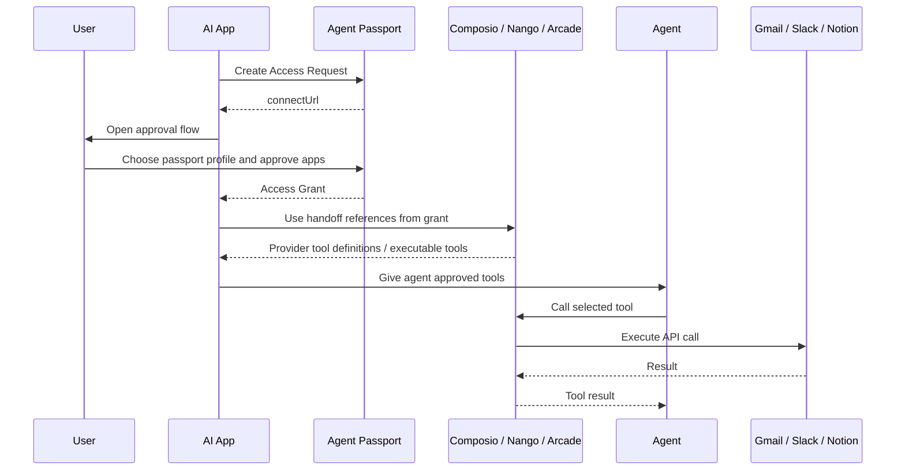
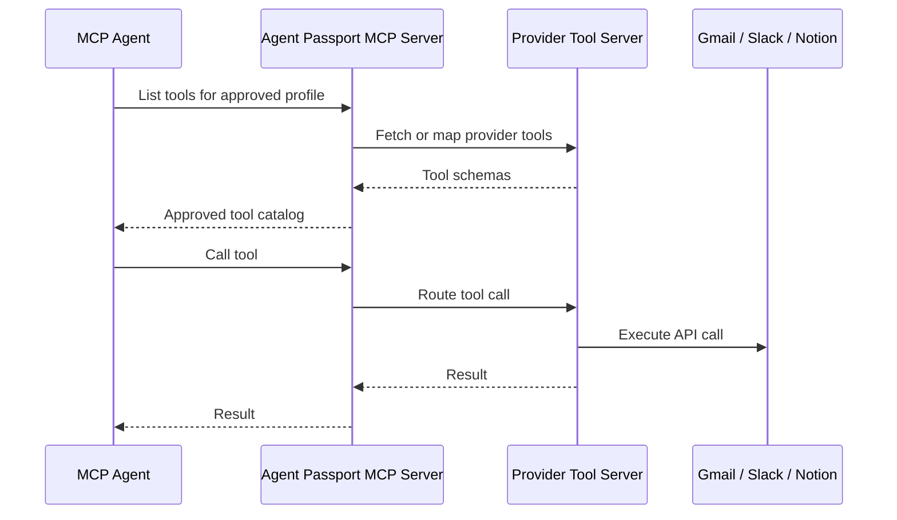
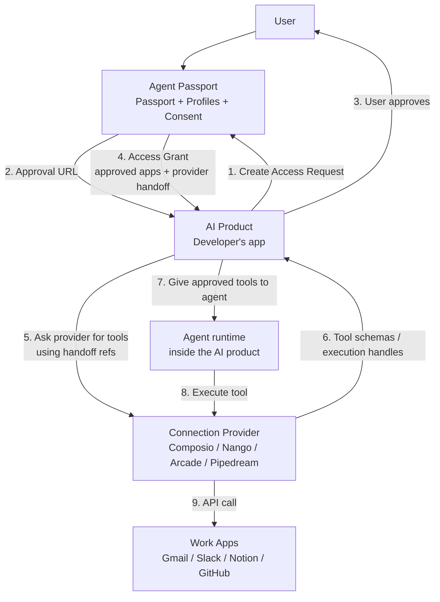

# Agent Passport Technical Model

Status: working model  
Goal: explain what Agent Passport owns, what providers own, and what an agent actually receives.

## Short Version

Agent Passport should not start as a tool execution platform.

It should start as the layer that answers:

> Which apps did this user approve for this AI product, and which provider should the product use for each app?

Agent Passport gives the developer app an **Access Grant**.

The developer app or agent then uses the chosen provider directly.

That means Agent Passport does not have to call Gmail, Slack, Notion, GitHub, or Composio tools in the first version.

## The Key Split

Agent Passport owns:

- the user's passport account
- passport profiles
- the approval screen
- which app access was approved
- which provider owns each connection
- a provider-aware access grant

Providers own:

- OAuth screens
- credential storage
- refresh tokens
- tool definitions
- actual API/tool execution

The developer app owns:

- its own product experience
- its agent runtime
- deciding which tools to call
- calling Composio, Nango, Arcade, Pipedream, or another provider

## Terms

The names are still not final.

This document uses **Access Request** and **Access Grant** because they describe the technical shape better than `session`.

That does not mean those are the final product words.

The product may still choose friendlier language like:

- Passport Request
- Connect Request
- App Access Grant
- Connection Grant
- Passport Grant

### Passport

The user's overall app-access identity.

Example:

```text
Nia's Agent Passport
```

It knows that Nia has connected apps like Gmail, Slack, Notion, Calendar, and GitHub.

### Passport Profile

A named set of app connections for a purpose.

Example:

```text
Work profile:
- Gmail
- Calendar
- Slack
- Notion

Engineering profile:
- GitHub
- Linear
- Slack
- Notion
```

Profiles matter because the user may not want every AI app to access every connected app.

### Access Request

The developer app asks for app access.

This is what we were calling a "session."

Example:

```text
Sales Agent App requests:
- Gmail
- Calendar
- Slack

Purpose:
Draft follow-up emails after sales calls.
```

`Session` is technically okay, but it is vague. It sounds like a temporary browser/login state, not a request to use a passport profile.

Better product/API words:

- `AccessRequest`
- `ConnectRequest`
- `PassportRequest`
- `GrantRequest`

Current recommendation:

Use **Access Request** in technical docs until we pick the final public term.

Use `accessRequests`, `connectRequests`, or `passportRequests` in the SDK instead of `sessions`.

### Access Grant

The approved result.

After the user approves, Agent Passport returns an Access Grant to the developer app.

The Access Grant says:

- which profile was approved
- which apps were approved
- which provider owns each connection
- what provider reference the developer should use next
- what scopes/status are known

It does not contain raw OAuth tokens.

### Provider Handoff

The provider-specific reference inside an Access Grant.

Example:

```json
{
  "provider": "composio",
  "handoff": {
    "type": "composio_connected_account",
    "entityId": "entity_123",
    "connectedAccountId": "ca_456"
  }
}
```

This tells the developer:

> Use Composio for this app. Here is the Composio-side reference.

## What The Agent Receives

There are two possible ways an agent can receive Agent Passport output.

Before the SDK is useful, we need an actual agent harness that consumes the grant.

That harness should prove:

- Agent Passport can create a request
- the app can receive a grant
- the grant can be translated into tools or provider references
- an agent can receive that output
- the agent can make a grounded decision about what it can and cannot call

Without that harness, the SDK is only a shape, not a tested developer experience.

### Option A: The App Receives The Grant, Then Gives The Agent Tools

This should be the default v0.

The developer app gets the Access Grant from Agent Passport.

Then the developer app uses its provider SDK to build the actual tool list for the agent.

Agent Passport does not give the agent the final tools directly.



Plain English:

1. The app asks Agent Passport for access.
2. The user approves a profile.
3. Agent Passport returns an Access Grant.
4. The app uses Composio/Nango/Arcade directly.
5. The provider gives the app/agent the real tools.
6. The agent calls the provider, not Agent Passport.

### Option B: Agent Passport Exposes An MCP Server Later

This is possible later, but it makes Agent Passport more responsible.

In this model, an agent connects to Agent Passport as an MCP server.

Agent Passport would expose tools or route to provider tools.



This is powerful, but it puts Agent Passport in the live execution path.

That means:

- more uptime burden
- more security burden
- more provider complexity
- more liability

So this should not be v0.

## Best v0 Architecture



Agent Passport is responsible for steps 1-4.

The provider and app are responsible for steps 5-9.

This is the line we want.

## ASCII Version

```text
USER
  owns a Passport
  has Profiles

        approves
           |
           v
AI APP -> AGENT PASSPORT -> ACCESS GRANT
           |
           | says:
           | - Gmail approved
           | - Slack approved
           | - Gmail lives in Composio account ca_123
           | - Slack lives in Composio account ca_456
           v
AI APP uses provider directly
           |
           v
COMPOSIO / NANGO / ARCADE
           |
           v
GMAIL / SLACK / NOTION
```

Agent Passport does not sit between every tool call.

It gives the app the approved map.

## Do We Provide The Toolset?

For v0: no.

Agent Passport should provide:

- approved apps
- provider references
- scopes/status
- profile metadata
- constraints/policy if known

The provider should provide:

- actual tool schemas
- tool execution
- API errors
- provider-specific behavior

The developer app combines them.

Example:

```ts
const grant = await passport.accessRequests.getGrant(request.id)

const gmail = grant.connections.find((connection) => connection.app === "gmail")

const tools = await composio.tools.get({
  entityId: gmail.handoff.entityId,
  connectedAccountId: gmail.handoff.connectedAccountId,
})

agent.run({
  tools,
  task: "Find the latest email from the customer and draft a reply."
})
```

Agent Passport is not the tool provider here.

It is the passport and consent layer.

## SDK Proposal

This is a proposed SDK shape, not final.

The next implementation should include a runnable agent harness before we claim the SDK is useful.

Use these nouns:

- `passport.accessRequests.create`
- `passport.accessRequests.get`
- `passport.accessRequests.getGrant`
- `passport.profiles.list`
- `passport.grants.revoke`

Avoid `sessions` in public docs unless we decide it is actually clearer after testing.

## Required Agent Harness

Build a small script before expanding the SDK.

The script should act like a real AI app:

```text
1. Create a passport request for Gmail and Slack.
2. Receive a mock Access Grant.
3. Convert that grant into an agent-readable tool manifest.
4. Give the manifest to a simple agent loop.
5. Ask the agent: "What tools can you use?"
6. Ask the agent to choose the right tool for a task.
7. Prove the agent does not receive raw tokens.
8. Prove the agent can see provider handoff metadata.
```

The harness does not need real Gmail or Slack calls.

It needs to prove the handoff shape makes sense for an agent runtime.

Example agent-readable manifest:

```json
{
  "availableApps": ["gmail", "slack"],
  "tools": [
    {
      "name": "gmail.search",
      "provider": "composio",
      "status": "available",
      "handoffRef": "ca_gmail_demo"
    },
    {
      "name": "slack.sendMessage",
      "provider": "composio",
      "status": "available",
      "handoffRef": "ca_slack_demo"
    }
  ]
}
```

This manifest is not the same thing as provider tool schemas.

It is the bridge between Agent Passport's grant and the provider's real tools.

### Create An Access Request

```ts
const request = await passport.accessRequests.create({
  externalUserId: "user_123",
  requestedApps: ["gmail", "slack", "notion"],
  purpose: "Draft customer follow-up emails",
  providerPreference: "composio"
})

console.log(request.approvalUrl)
```

### User Approves

The user sees:

```text
Sales Agent wants access to:

- Gmail
- Slack
- Notion

Choose a passport profile:

[Work]
[Sales]
[Create new profile]
```

### App Gets An Access Grant

```ts
const grant = await passport.accessRequests.getGrant(request.id)
```

Example response:

```json
{
  "id": "grant_123",
  "accessRequestId": "req_123",
  "status": "approved",
  "profile": {
    "id": "profile_work",
    "name": "Work"
  },
  "connections": [
    {
      "app": "gmail",
      "status": "ready",
      "provider": "composio",
      "scopes": ["gmail.readonly"],
      "handoff": {
        "type": "composio_connected_account",
        "entityId": "entity_123",
        "connectedAccountId": "ca_gmail_123"
      }
    },
    {
      "app": "slack",
      "status": "ready",
      "provider": "composio",
      "scopes": ["channels:read", "chat:write"],
      "handoff": {
        "type": "composio_connected_account",
        "entityId": "entity_123",
        "connectedAccountId": "ca_slack_456"
      }
    }
  ]
}
```

## What Works Regardless Of Provider

The stable part is the Access Grant shape.

Every provider-specific connection can be wrapped like this:

```json
{
  "app": "gmail",
  "provider": "some-provider",
  "status": "ready",
  "scopes": [],
  "handoff": {
    "type": "provider-specific-reference"
  }
}
```

The exact `handoff` object changes by provider.

The rest should stay stable.

That lets Agent Passport support Composio first, then Nango, Arcade, Pipedream, or custom OAuth later.

## What We Should Not Promise

Do not promise:

- raw token portability
- one universal tool schema across all providers
- that Agent Passport executes every tool
- that a Composio connection in one developer project can automatically be copied into another developer's Composio project
- that every provider supports the same handoff shape

Do promise:

- reusable user consent
- passport profiles
- approved app access
- provider-aware handoff
- a stable Access Grant contract

## Final Recommendation

Build SDK v0 around **Access Requests** and **Access Grants**.

Do not build tool execution into v0.

Do not call the public concept a "session."

Use:

```text
Access Request -> user approval -> Access Grant -> provider handoff
```

That is the simplest model that can work across providers without making Agent Passport own the full pipeline.
